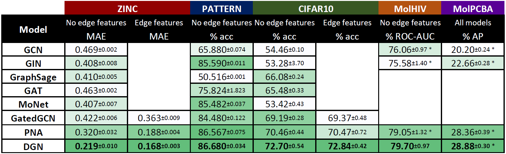

# Real-world benchmarks



## Overview

We provide the scripts for the download and execution of the real-world benchmarks we used. Many scripts in this directory were taken directly from or inspired by "Benchmarking GNNs" by Dwivedi _et al._ refer to their [code](https://github.com/graphdeeplearning/benchmarking-gnns) and [paper](https://arxiv.org/abs/2003.00982) for more details on their work.

- `configs` contains .json configuration files for the various datasets;
- `data` contains scripts to download the datasets and python's classes to load pkl datasets;
- `nets` contains the architectures (layers and nets) that were used with the DGN in the benchmarks;
- `train` contains the training scripts.
  
All of the benchmarks use the DGL version of DGN (`../models/dgl`)

## Test run

### Benchmark Setup

[Follow these instructions](./docs/setup.md) to install the benchmark and setup the environment.

### Run model training
```
# at the root of the repo
cd realworld_benchmark
python { main_molecules.py | main_SBMs_node_classification.py | main_molecules.py } [--param=value ...] --dataset { ZINC | PATTERN | CIFAR10 } --gpu_id g͟p͟u͟_͟i͟d͟ --config c͟͟o͟n͟f͟i͟g͟_͟f͟i͟l͟e͟

```

### Fair comparison


You can find below the scripts used to run the fair comparison between the DGN models. 

```
--- DGN ---

# ZINC
# simple
python main_molecules.py --type="simple" --lap_norm="none" --weight_decay=1e-8 --dropout=0.0 --L=4 --hidden_dim=80 --out_dim=80 --residual=True --edge_feat=False  --readout=mean --graph_norm=True --batch_norm=True --aggregators="mean" --scalers="identity attenuation amplification" --dataset ZINC --gpu_id 0 --config "configs/molecules_graph_regression_DGN_ZINC.json" --lr_schedule_patience=20
python main_molecules.py --type="simple" --lap_norm="none" --weight_decay=3e-6 --dropout=0.0 --L=4 --hidden_dim=63 --out_dim=63 --residual=True --edge_feat=False  --readout=mean --graph_norm=True --batch_norm=True --aggregators="mean dir1-dx" --scalers="identity attenuation amplification" --dataset ZINC --gpu_id 0 --config "configs/molecules_graph_regression_DGN_ZINC.json" --lr_schedule_patience=20
python main_molecules.py --type="simple" --lap_norm="none" --weight_decay=1e-8 --dropout=0.0 --L=4 --hidden_dim=52 --out_dim=52 --residual=True --edge_feat=False  --readout=mean --graph_norm=True --batch_norm=True --aggregators="mean dir1-dx dir2-dx" --scalers="identity attenuation amplification" --dataset ZINC --gpu_id 0 --config "configs/molecules_graph_regression_DGN_ZINC.json" --lr_schedule_patience=20
python main_molecules.py --type="simple" --lap_norm="none" --weight_decay=3e-6 --dropout=0.0 --L=4 --hidden_dim=63 --out_dim=63 --residual=True --edge_feat=False  --readout=mean --graph_norm=True --batch_norm=True --aggregators="mean dir1-av" --scalers="identity attenuation amplification" --dataset ZINC --gpu_id 0 --config "configs/molecules_graph_regression_DGN_ZINC.json" --lr_schedule_patience=20
python main_molecules.py --type="simple" --lap_norm="none" --weight_decay=1e-8 --dropout=0.0 --L=4 --hidden_dim=52 --out_dim=52 --residual=True --edge_feat=False  --readout=mean --graph_norm=True --batch_norm=True --aggregators="mean dir1-av dir2-av" --scalers="identity attenuation amplification" --dataset ZINC --gpu_id 0 --config "configs/molecules_graph_regression_DGN_ZINC.json" --lr_schedule_patience=20
python main_molecules.py --type="simple" --lap_norm="none" --weight_decay=1e-8 --dropout=0.0 --L=4 --hidden_dim=52 --out_dim=52 --residual=True --edge_feat=False  --readout=mean --graph_norm=True --batch_norm=True --aggregators="mean dir1-av dir2-av" --scalers="identity attenuation amplification" --dataset ZINC --gpu_id 0 --config "configs/molecules_graph_regression_DGN_ZINC.json" --lr_schedule_patience=20
python main_molecules.py --type="simple" --lap_norm="none" --weight_decay=3e-6 --dropout=0.0 --L=4 --hidden_dim=52 --out_dim=52 --residual=True --edge_feat=False  --readout=mean --graph_norm=True --batch_norm=True --aggregators="mean dir1-av dir1-dx" --scalers="identity attenuation amplification" --dataset ZINC --gpu_id 0 --config "configs/molecules_graph_regression_DGN_ZINC.json" --lr_schedule_patience=20
# complex
python main_molecules.py --type="complex" --lap_norm="none" --weight_decay=3e-6 --dropout=0.0 --L=4 --hidden_dim=65 --out_dim=65 --residual=True --edge_feat=False  --readout=mean --graph_norm=True --batch_norm=True --aggregators="mean" --scalers="identity attenuation amplification" --dataset ZINC --gpu_id 0 --config "configs/molecules_graph_regression_DGN_ZINC.json" --lr_schedule_patience=20
python main_molecules.py --type="complex" --lap_norm="none" --weight_decay=3e-6 --dropout=0.0 --L=4 --hidden_dim=52 --out_dim=52 --residual=True --edge_feat=False  --readout=mean --graph_norm=True --batch_norm=True --aggregators="mean dir1-dx" --scalers="identity attenuation amplification" --dataset ZINC --gpu_id 0 --config "configs/molecules_graph_regression_DGN_ZINC.json" --lr_schedule_patience=20
python main_molecules.py --type="complex" --lap_norm="none" --weight_decay=3e-6 --dropout=0.0 --L=4 --hidden_dim=45 --out_dim=45 --residual=True --edge_feat=False  --readout=mean --graph_norm=True --batch_norm=True --aggregators="mean dir1-dx dir2-dx" --scalers="identity attenuation amplification" --dataset ZINC --gpu_id 0 --config "configs/molecules_graph_regression_DGN_ZINC.json" --lr_schedule_patience=20
python main_molecules.py --type="complex" --lap_norm="none" --weight_decay=3e-6 --dropout=0.0 --L=4 --hidden_dim=52 --out_dim=52 --residual=True --edge_feat=False  --readout=mean --graph_norm=True --batch_norm=True --aggregators="mean dir1-av" --scalers="identity attenuation amplification" --dataset ZINC --gpu_id 0 --config "configs/molecules_graph_regression_DGN_ZINC.json" --lr_schedule_patience=20
python main_molecules.py --type="complex" --lap_norm="none" --weight_decay=3e-6 --dropout=0.0 --L=4 --hidden_dim=45 --out_dim=45 --residual=True --edge_feat=False  --readout=mean --graph_norm=True --batch_norm=True --aggregators="mean dir1-av dir2-av" --scalers="identity attenuation amplification" --dataset ZINC --gpu_id 0 --config "configs/molecules_graph_regression_DGN_ZINC.json" --lr_schedule_patience=20
python main_molecules.py --type="complex" --lap_norm="none" --weight_decay=3e-6 --dropout=0.0 --L=4 --hidden_dim=45 --out_dim=45 --residual=True --edge_feat=False  --readout=mean --graph_norm=True --batch_norm=True --aggregators="mean dir1-dx dir1-av" --scalers="identity attenuation amplification" --dataset ZINC --gpu_id 0 --config "configs/molecules_graph_regression_DGN_ZINC.json" --lr_schedule_patience=20
# complex with edge features
python main_molecules.py --type="complex" --lap_norm="none" --weight_decay=3e-6 --dropout=0.0 --L=4 --hidden_dim=65 --out_dim=65 --residual=True --edge_feat=True --edge_dim=10  --readout=mean --graph_norm=True --batch_norm=True --aggregators="mean" --scalers="identity attenuation amplification" --dataset ZINC --gpu_id 0 --config "configs/molecules_graph_regression_DGN_ZINC.json" --lr_schedule_patience=20
python main_molecules.py --type="complex" --lap_norm="none" --weight_decay=3e-6 --dropout=0.0 --L=4 --hidden_dim=52 --out_dim=52 --residual=True --edge_feat=True --edge_dim=10  --readout=mean --graph_norm=True --batch_norm=True --aggregators="mean dir1-dx" --scalers="identity attenuation amplification" --dataset ZINC --gpu_id 0 --config "configs/molecules_graph_regression_DGN_ZINC.json" --lr_schedule_patience=20
python main_molecules.py --type="complex" --lap_norm="none" --weight_decay=3e-6 --dropout=0.0 --L=4 --hidden_dim=45 --out_dim=45 --residual=True --edge_feat=True --edge_dim=10  --readout=mean --graph_norm=True --batch_norm=True --aggregators="mean dir1-dx dir2-dx" --scalers="identity attenuation amplification" --dataset ZINC --gpu_id 0 --config "configs/molecules_graph_regression_DGN_ZINC.json" --lr_schedule_patience=20
python main_molecules.py --type="complex" --lap_norm="none" --weight_decay=3e-6 --dropout=0.0 --L=4 --hidden_dim=52 --out_dim=52 --residual=True --edge_feat=True --edge_dim=10  --readout=mean --graph_norm=True --batch_norm=True --aggregators="mean dir1-av" --scalers="identity attenuation amplification" --dataset ZINC --gpu_id 0 --config "configs/molecules_graph_regression_DGN_ZINC.json" --lr_schedule_patience=20
python main_molecules.py --type="complex" --lap_norm="none" --weight_decay=3e-6 --dropout=0.0 --L=4 --hidden_dim=45 --out_dim=45 --residual=True --edge_feat=True --edge_dim=10  --readout=mean --graph_norm=True --batch_norm=True --aggregators="mean dir1-av dir2-av" --scalers="identity attenuation amplification" --dataset ZINC --gpu_id 0 --config "configs/molecules_graph_regression_DGN_ZINC.json" --lr_schedule_patience=20
python main_molecules.py --type="complex" --lap_norm="none" --weight_decay=3e-6 --dropout=0.0 --L=4 --hidden_dim=45 --out_dim=45 --residual=True --edge_feat=True --edge_dim=10  --readout=mean --graph_norm=True --batch_norm=True --aggregators="mean dir1-dx dir1-av" --scalers="identity attenuation amplification" --dataset ZINC --gpu_id 0 --config "configs/molecules_graph_regression_DGN_ZINC.json" --lr_schedule_patience=20

# PATTERN
# simple
python main_SBMs_node_classification.py --type='simple' --lap_norm='none' --weight_decay=1e-8 --L=4 --hidden_dim=80 --out_dim=80 --residual=True --edge_feat=False  --readout=mean --graph_norm=True --batch_norm=True --aggregators="mean" --scalers="identity attenuation amplification" --dataset='SBM_PATTERN' --gpu_id 0 --config "configs/SBMs_node_clustering_DGN_PATTERN.json" --lr_schedule_patience=5
python main_SBMs_node_classification.py --type="simple" --lap_norm="none" --weight_decay=1e-8 --L=4 --hidden_dim=63 --out_dim=63 --residual=True --edge_feat=False  --readout=mean --graph_norm=True --batch_norm=True --aggregators="mean dir1-dx" --scalers="identity attenuation amplification" --dataset="SBM_PATTERN" --gpu_id 0 --config "configs/SBMs_node_clustering_DGN_PATTERN.json" --lr_schedule_patience=5
python main_SBMs_node_classification.py --type='simple' --lap_norm='none' --weight_decay=1e-8 --L=4 --hidden_dim=52 --out_dim=52 --residual=True --edge_feat=False  --readout=mean --graph_norm=True --batch_norm=True --aggregators="mean dir1-dx dir2-dx" --scalers="identity attenuation amplification" --dataset='SBM_PATTERN' --gpu_id 0 --config "configs/SBMs_node_clustering_DGN_PATTERN.json" --lr_schedule_patience=5
python main_SBMs_node_classification.py --type="simple" --lap_norm="none" --weight_decay=1e-8 --L=4 --hidden_dim=63 --out_dim=63 --residual=True --edge_feat=False  --readout=mean --graph_norm=True --batch_norm=True --aggregators="mean dir1-av" --scalers="identity attenuation amplification" --dataset="SBM_PATTERN" --gpu_id 0 --config "configs/SBMs_node_clustering_DGN_PATTERN.json" --lr_schedule_patience=5
python main_SBMs_node_classification.py --type='simple' --lap_norm='none' --weight_decay=1e-8 --L=4 --hidden_dim=52 --out_dim=52 --residual=True --edge_feat=False  --readout=mean --graph_norm=True --batch_norm=True --aggregators="mean dir1-av dir2-av " --scalers="identity attenuation amplification" --dataset='SBM_PATTERN' --gpu_id 0 --config "configs/SBMs_node_clustering_DGN_PATTERN.json" --lr_schedule_patience=5
python main_SBMs_node_classification.py --type="simple" --lap_norm="none" --weight_decay=1e-8 --L=4 --hidden_dim=52 --out_dim=52 --residual=True --edge_feat=False  --readout=mean --graph_norm=True --batch_norm=True --aggregators="mean dir1-av dir1-dx" --scalers="identity attenuation amplification" --dataset="SBM_PATTERN" --gpu_id 0 --config "configs/SBMs_node_clustering_DGN_PATTERN.json" --lr_schedule_patience=5
# complex
python main_SBMs_node_classification.py --type='complex' --lap_norm='none' --weight_decay=1e-8 --L=4 --hidden_dim=55 --out_dim=55 --residual=True --edge_feat=False  --readout=mean --graph_norm=True --batch_norm=True --aggregators="mean" --scalers="identity attenuation amplification" --dataset='SBM_PATTERN' --gpu_id 0 --config "configs/SBMs_node_clustering_DGN_PATTERN.json" --lr_schedule_patience=5
python main_SBMs_node_classification.py --type="complex" --lap_norm="none" --weight_decay=1e-8 --L=4 --hidden_dim=52 --out_dim=52 --residual=True --edge_feat=False  --readout=mean --graph_norm=True --batch_norm=True --aggregators="mean dir1-dx" --scalers="identity attenuation amplification" --dataset="SBM_PATTERN" --gpu_id 0 --config "configs/SBMs_node_clustering_DGN_PATTERN.json" --lr_schedule_patience=5
python main_SBMs_node_classification.py --type="complex" --lap_norm="none" --weight_decay=1e-8 --L=4 --hidden_dim=47 --out_dim=47 --residual=True --edge_feat=False  --readout=mean --graph_norm=True --batch_norm=True --aggregators="mean dir1-dx dir2-dx" --scalers="identity attenuation amplification" --dataset="SBM_PATTERN" --gpu_id 0 --config "configs/SBMs_node_clustering_DGN_PATTERN.json" --lr_schedule_patience=5
python main_SBMs_node_classification.py --type="complex" --lap_norm="none" --weight_decay=1e-8 --L=4 --hidden_dim=52 --out_dim=52 --residual=True --edge_feat=False  --readout=mean --graph_norm=True --batch_norm=True --aggregators="mean dir1-av" --scalers="identity attenuation amplification" --dataset="SBM_PATTERN" --gpu_id 0 --config "configs/SBMs_node_clustering_DGN_PATTERN.json" --lr_schedule_patience=5
python main_SBMs_node_classification.py --type="complex" --lap_norm="none" --weight_decay=1e-8 --L=4 --hidden_dim=47 --out_dim=47 --residual=True --edge_feat=False  --readout=mean --graph_norm=True --batch_norm=True --aggregators="mean dir1-av dir2-av" --scalers="identity attenuation amplification" --dataset="SBM_PATTERN" --gpu_id 0 --config "configs/SBMs_node_clustering_DGN_PATTERN.json" --lr_schedule_patience=5
python main_SBMs_node_classification.py --type="complex" --lap_norm="none" --weight_decay=1e-8 --L=4 --hidden_dim=47 --out_dim=47 --residual=True --edge_feat=False  --readout=mean --graph_norm=True --batch_norm=True --aggregators="mean dir1-av dir1-dx" --scalers="identity attenuation amplification" --dataset="SBM_PATTERN" --gpu_id 0 --config "configs/SBMs_node_clustering_DGN_PATTERN.json" --lr_schedule_patience=5

# CIFAR10
# simple
python main_superpixels.py --type="simple" --lap_norm="none" --coord_eig --weight_decay=1e-8 --L=4 --hidden_dim=145 --out_dim=145 --residual=True --edge_feat=False --readout=mean --in_feat_dropout=0.0 --dropout=0.3 --graph_norm=True --batch_norm=True --aggregators="mean" --scalers="identity" --dataset CIFAR10 --gpu_id 0 --config "configs/superpixels_graph_classification_DGN_CIFAR10.json" --lr_schedule_patience=5
python main_superpixels.py --type="simple" --lap_norm="none" --coord_eig --weight_decay=1e-8 --L=4 --hidden_dim=90 --out_dim=90 --residual=True --edge_feat=False --readout=mean --in_feat_dropout=0.0 --dropout=0.3 --graph_norm=True --batch_norm=True --aggregators="mean dir1-dx dir2-dx" --scalers="identity" --dataset CIFAR10 --gpu_id 0 --config "configs/superpixels_graph_classification_DGN_CIFAR10.json" --lr_schedule_patience=5
python main_superpixels.py --type="simple" --lap_norm="none" --coord_eig --weight_decay=1e-8 --L=4 --hidden_dim=90 --out_dim=90 --residual=True --edge_feat=False --readout=mean --in_feat_dropout=0.0 --dropout=0.3 --graph_norm=True --batch_norm=True --aggregators="mean dir1-av dir2-av" --scalers="identity" --dataset CIFAR10 --gpu_id 0 --config "configs/superpixels_graph_classification_DGN_CIFAR10.json" --lr_schedule_patience=5
# complex
python main_superpixels.py --type="complex" --lap_norm="none" --coord_eig --weight_decay=3e-6 --L=4 --hidden_dim=75 --out_dim=75 --residual=True --edge_feat=False --readout=mean --in_feat_dropout=0.0 --dropout=0.3 --graph_norm=True --batch_norm=True --aggregators="mean" --scalers="identity" --dataset CIFAR10 --gpu_id 0 --config "configs/superpixels_graph_classification_DGN_CIFAR10.json" --lr_schedule_patience=5
python main_superpixels.py --type="complex" --lap_norm="none" --coord_eig --weight_decay=3e-6 --L=4 --hidden_dim=65 --out_dim=65 --residual=True --edge_feat=False --readout=mean --in_feat_dropout=0.0 --dropout=0.3 --graph_norm=True --batch_norm=True --aggregators="mean dir1-dx dir2-dx" --scalers="identity" --dataset CIFAR10 --gpu_id 0 --config "configs/superpixels_graph_classification_DGN_CIFAR10.json" --lr_schedule_patience=5
python main_superpixels.py --type="complex" --lap_norm="none" --coord_eig --weight_decay=3e-6 --L=4 --hidden_dim=65 --out_dim=65 --residual=True --edge_feat=False --readout=mean --in_feat_dropout=0.0 --dropout=0.3 --graph_norm=True --batch_norm=True --aggregators="mean dir1-av dir2-av" --scalers="identity" --dataset CIFAR10 --gpu_id 0 --config "configs/superpixels_graph_classification_DGN_CIFAR10.json" --lr_schedule_patience=5

# MolHIV
# simple
python -m main_HIV --weight_decay=3e-6 --L=4 --type_net="simple" --hidden_dim=145 --out_dim=145 --residual=True --edge_feat=False --readout=mean --in_feat_dropout=0.0 --dropout=0.3 --graph_norm=False --batch_norm=True --aggregators="mean" --scalers="identity" --dataset HIV --gpu_id 0 --config "configs/molecules_graph_classification_DGN_HIV.json" --epochs=200 --init_lr=0.01 --lr_reduce_factor=0.5 --lr_schedule_patience=20 --min_lr=0.0001
python -m main_HIV --weight_decay=3e-6 --L=4 --type_net="simple" --hidden_dim=100 --out_dim=100 --residual=True --edge_feat=False --readout=mean --in_feat_dropout=0.0 --dropout=0.3 --graph_norm=False --batch_norm=True --aggregators="mean dir1-dx" --scalers="identity" --dataset HIV --gpu_id 0 --config "configs/molecules_graph_classification_DGN_HIV.json" --epochs=200 --init_lr=0.01 --lr_reduce_factor=0.5 --lr_schedule_patience=20 --min_lr=0.0001
python -m main_HIV --weight_decay=3e-6 --L=4 --type_net="simple" --hidden_dim=90 --out_dim=90 --residual=True --edge_feat=False --readout=mean --in_feat_dropout=0.0 --dropout=0.3 --graph_norm=False --batch_norm=True --aggregators="mean dir1-dx dir2-dx" --scalers="identity" --dataset HIV --gpu_id 0 --config "configs/molecules_graph_classification_DGN_HIV.json" --epochs=200 --init_lr=0.01 --lr_reduce_factor=0.5 --lr_schedule_patience=20 --min_lr=0.0001
python -m main_HIV --weight_decay=3e-6 --L=4 --type_net="simple" --hidden_dim=100 --out_dim=100 --residual=True --edge_feat=False --readout=mean --in_feat_dropout=0.0 --dropout=0.3 --graph_norm=False --batch_norm=True --aggregators="mean dir1-av" --scalers="identity" --dataset HIV --gpu_id 0 --config "configs/molecules_graph_classification_DGN_HIV.json" --epochs=200 --init_lr=0.01 --lr_reduce_factor=0.5 --lr_schedule_patience=20 --min_lr=0.0001
python -m main_HIV --weight_decay=3e-6 --L=4 --type_net="simple" --hidden_dim=90 --out_dim=90 --residual=True --edge_feat=False --readout=mean --in_feat_dropout=0.0 --dropout=0.3 --graph_norm=False --batch_norm=True --aggregators="mean dir1-av dir2-av" --scalers="identity" --dataset HIV --gpu_id 0 --config "configs/molecules_graph_classification_DGN_HIV.json" --epochs=200 --init_lr=0.01 --lr_reduce_factor=0.5 --lr_schedule_patience=20 --min_lr=0.001
python -m main_HIV --weight_decay=3e-6 --L=4 --type_net="simple" --hidden_dim=90 --out_dim=90 --residual=True --edge_feat=False --readout=mean --in_feat_dropout=0.0 --dropout=0.3 --graph_norm=False --batch_norm=True --aggregators="mean dir1-av dir1-dx" --scalers="identity" --dataset HIV --gpu_id 0 --config "configs/molecules_graph_classification_DGN_HIV.json" --epochs=200 --init_lr=0.01 --lr_reduce_factor=0.5 --lr_schedule_patience=20 --min_lr=0.001

# MolPCBA
# complex
python main_PCBA.py --type_net="complex" --batch_size=512 --lap_norm="none" --weight_decay=3e-6 --L=6 --hidden_dim=440 --out_dim=440 --residual=True --edge_feat=False  --readout=sum --graph_norm=True --batch_norm=True --aggregators="mean" --scalers="identity attenuation amplification" --gpu_id 0 --config "configs/molecules_graph_classification_DGN_PCBA.json"  --lr_schedule_patience=5 --towers=2 --dropout=0.2 --init_lr=0.0005 --min_lr=0.00001
python main_PCBA.py --type_net="complex" --batch_size=512 --lap_norm="none" --weight_decay=3e-6 --L=6 --hidden_dim=360 --out_dim=360 --residual=True --edge_feat=False  --readout=sum --graph_norm=True --batch_norm=True --aggregators="mean dir1-smooth" --scalers="identity attenuation amplification" --gpu_id 0 --config "configs/molecules_graph_classification_DGN_PCBA.json"  --lr_schedule_patience=5 --towers=2 --dropout=0.2 --init_lr=0.0005 --min_lr=0.00001
python main_PCBA.py --type_net="complex" --batch_size=512 --lap_norm="none" --weight_decay=3e-6 --L=6 --hidden_dim=360 --out_dim=360 --residual=True --edge_feat=False  --readout=sum --graph_norm=True --batch_norm=True --aggregators="mean dir1-dx" --scalers="identity attenuation amplification" --gpu_id 0 --config "configs/molecules_graph_classification_DGN_PCBA.json"  --lr_schedule_patience=5 --towers=2 --dropout=0.2 --init_lr=0.0005 --min_lr=0.00001
python main_PCBA.py --type_net="complex" --batch_size=512 --lap_norm="none" --weight_decay=3e-6 --L=6 --hidden_dim=310 --out_dim=310 --residual=True --edge_feat=False  --readout=sum --graph_norm=True --batch_norm=True --aggregators="mean dir1-dx dir1-smooth" --scalers="identity attenuation amplification" --gpu_id 0 --config "configs/molecules_graph_classification_DGN_PCBA.json"  --lr_schedule_patience=5 --towers=2 --dropout=0.2 --init_lr=0.0005 --min_lr=0.00001
python main_PCBA.py --type_net="complex" --batch_size=512 --lap_norm="none" --weight_decay=3e-6 --L=6 --hidden_dim=310 --out_dim=310 --residual=True --edge_feat=False  --readout=sum --graph_norm=True --batch_norm=True --aggregators="mean dir1-dx dir2-dx" --scalers="identity attenuation amplification" --gpu_id 0 --config "configs/molecules_graph_classification_DGN_PCBA.json"  --lr_schedule_patience=5 --towers=2 --dropout=0.2 --init_lr=0.0005 --min_lr=0.00001
python main_PCBA.py --type_net="complex" --batch_size=512 --lap_norm="none" --weight_decay=3e-6 --L=6 --hidden_dim=310 --out_dim=310 --residual=True --edge_feat=False  --readout=sum --graph_norm=True --batch_norm=True --aggregators="mean dir1-smooth dir2-smooth" --scalers="identity attenuation amplification" --gpu_id 0 --config "configs/molecules_graph_classification_DGN_PCBA.json"  --lr_schedule_patience=5 --towers=2 --dropout=0.2 --init_lr=0.0005 --min_lr=0.00001

# complex with edge features
python main_PCBA.py --type_net="complex" --batch_size=512 --lap_norm="none" --weight_decay=3e-6 --L=4 --hidden_dim=512 --out_dim=512 --residual=True --edge_feat=True  --readout=sum --graph_norm=True --batch_norm=True --aggregators="mean" --scalers="identity attenuation amplification" --gpu_id 0 --config "configs/molecules_graph_classification_DGN_PCBA.json"  --lr_schedule_patience=5 --towers=2 --dropout=0.2 --init_lr=0.0005 --min_lr=0.00001 --edge_dim=16
python main_PCBA.py --type_net="complex" --batch_size=512 --lap_norm="none" --weight_decay=3e-6 --L=4 --hidden_dim=450 --out_dim=450 --residual=True --edge_feat=True  --readout=sum --graph_norm=True --batch_norm=True --aggregators="mean dir1-smooth" --scalers="identity attenuation amplification" --gpu_id 0 --config "configs/molecules_graph_classification_DGN_PCBA.json"  --lr_schedule_patience=5 --towers=2 --dropout=0.2 --init_lr=0.0005 --min_lr=0.00001 --edge_dim=16
python main_PCBA.py --type_net="complex" --batch_size=512 --lap_norm="none" --weight_decay=3e-6 --L=4 --hidden_dim=450 --out_dim=450 --residual=True --edge_feat=True  --readout=sum --graph_norm=True --batch_norm=True --aggregators="mean dir1-dx" --scalers="identity attenuation amplification" --gpu_id 0 --config "configs/molecules_graph_classification_DGN_PCBA.json"  --lr_schedule_patience=5 --towers=2 --dropout=0.2 --init_lr=0.0005 --min_lr=0.00001 --edge_dim=16
python main_PCBA.py --type_net="complex" --batch_size=512 --lap_norm="none" --weight_decay=3e-6 --L=4 --hidden_dim=400 --out_dim=400 --residual=True --edge_feat=True  --readout=sum --graph_norm=True --batch_norm=True --aggregators="mean dir1-dx dir1-smooth" --scalers="identity attenuation amplification" --gpu_id 0 --config "configs/molecules_graph_classification_DGN_PCBA.json"  --lr_schedule_patience=5 --towers=2 --dropout=0.2 --init_lr=0.0005 --min_lr=0.00001 --edge_dim=16
python main_PCBA.py --type_net="complex" --batch_size=512 --lap_norm="none" --weight_decay=3e-6 --L=4 --hidden_dim=400 --out_dim=400 --residual=True --edge_feat=True  --readout=sum --graph_norm=True --batch_norm=True --aggregators="mean dir1-dx dir2-dx" --scalers="identity attenuation amplification" --gpu_id 0 --config "configs/molecules_graph_classification_DGN_PCBA.json"  --lr_schedule_patience=5 --towers=2 --dropout=0.2 --init_lr=0.0005 --min_lr=0.00001 --edge_dim=16
python main_PCBA.py --type_net="complex" --batch_size=512 --lap_norm="none" --weight_decay=3e-6 --L=4 --hidden_dim=400 --out_dim=400 --residual=True --edge_feat=True  --readout=sum --graph_norm=True --batch_norm=True --aggregators="mean dir1-smooth dir2-smooth" --scalers="identity attenuation amplification" --gpu_id 0 --config "configs/molecules_graph_classification_DGN_PCBA.json"  --lr_schedule_patience=5 --towers=2 --dropout=0.2 --init_lr=0.0005 --min_lr=0.00001 --edge_dim=16
```


### Tuned hyperparameters

You can find below the scripts of the best fine-tuned DGN model for each dataset.

```
# ZINC

100k parameters:
python main_molecules.py --type="towers" --lap_norm="none" --weight_decay=3e-7 --L=4 --hidden_dim=75 --out_dim=70 --residual=True --edge_feat=True --edge_dim=10 --readout=sum --in_feat_dropout=0.0 --dropout=0.0 --graph_norm=True --batch_norm=True --aggregators="mean dir1-dx max min" --scalers="identity amplification attenuation" --towers=5 --divide_input_first=False --divide_input_last=True  --dataset ZINC --gpu_id 0 --config "configs/molecules_graph_regression_DGN_ZINC.json" --lr_schedule_patience=20

500k parameters:
python main_molecules.py --type="complex" --batch_size=128 --lap_norm="none" --weight_decay=3e-6 --L=4 --hidden_dim=285 --out_dim=285 --residual=True --edge_feat=True --edge_dim=10 --readout=sum --in_feat_dropout=0.0 --dropout=0.05 --graph_norm=True --batch_norm=True --aggregators="mean dir1-dx max min" --scalers="identity amplification attenuation" --towers=5 --divide_input_first=False --divide_input_last=True --dataset ZINC --gpu_id 0 --config "configs/molecules_graph_regression_DGN_ZINC.json" --lr_schedule_patience=25

# CIFAR10

python main_superpixels.py --type="towers" --coord_eig --weight_decay=3e-6 --L=4 --hidden_dim=100 --out_dim=95 --residual=True --edge_feat=True --edge_dim=10 --readout=sum --in_feat_dropout=0.0 --dropout=0.3 --graph_norm=True --batch_norm=True --aggregators="mean dir1-dx dir2-dx max" --scalers="identity" --towers=5 --divide_input_first=True --divide_input_last=False  --dataset CIFAR10 --gpu_id 0 --config "configs/superpixels_graph_classification_DGN_CIFAR10.json" --lr_schedule_patience=5

# PATTERN

python main_SBMs_node_classification.py --type="complex" --lap_norm="none" --weight_decay=1e-8 --L=4 --hidden_dim=47 --out_dim=47 --residual=True --edge_feat=False  --readout=mean --graph_norm=True --batch_norm=True --aggregators="mean dir1-av dir1-dx" --scalers="identity attenuation amplification" --dataset="SBM_PATTERN" --gpu_id 0 --config "configs/SBMs_node_clustering_DGN_PATTERN.json" --lr_schedule_patience=5

# MolHIV

python -m main_HIV --weight_decay=3e-6 --L=4 --type_net="simple" --hidden_dim=70 --out_dim=70 --residual=True --edge_feat=False --readout=mean --in_feat_dropout=0.0 --dropout=0.3 --graph_norm=False --batch_norm=True --aggregators="mean max min dir1-av dir1-dx" --scalers="identity" --dataset HIV --gpu_id 0 --config "configs/molecules_graph_classification_DGN_HIV.json" --epochs=200 --init_lr=0.01 --lr_reduce_factor=0.5 --lr_schedule_patience=20 --min_lr=0.0001

# MolPCBA 

python main_PCBA.py --type_net="complex" --batch_size=2048 --lap_norm="none" --weight_decay=1e-5 --L=4 --hidden_dim=480 --out_dim=480 --residual=True --edge_feat=True --readout=sum --graph_norm=True --batch_norm=True --aggregators="mean sum max dir1-dx" --scalers="identity" --gpu_id 0 --config "configs/molecules_graph_classification_DGN_PCBA.json" --lr_schedule_patience=8 --dropout=0.2 --init_lr=0.0005 --min_lr=0.00002 --edge_dim=16 --lr_reduce_factor=0.8
```
